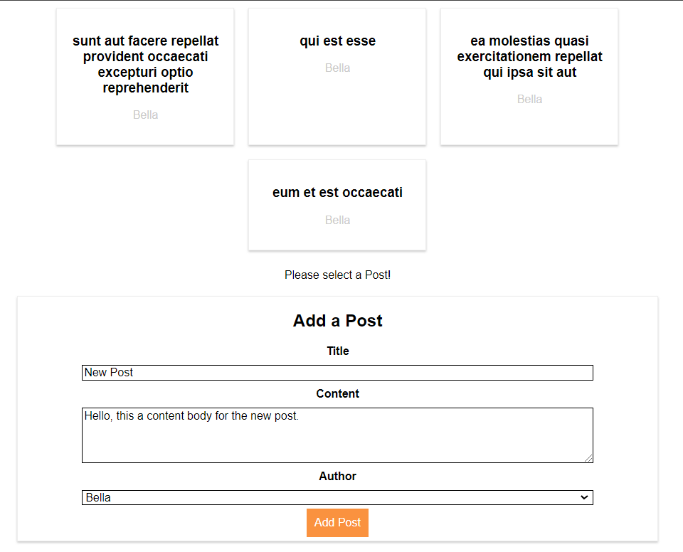

## Project for adding posts with title, content and author

## Available Scripts

In the project directory, you can run:

### `npm start`

### Install axios, third party library promise based HTTP client for the browser

`npm install axios --save`

### App UI

